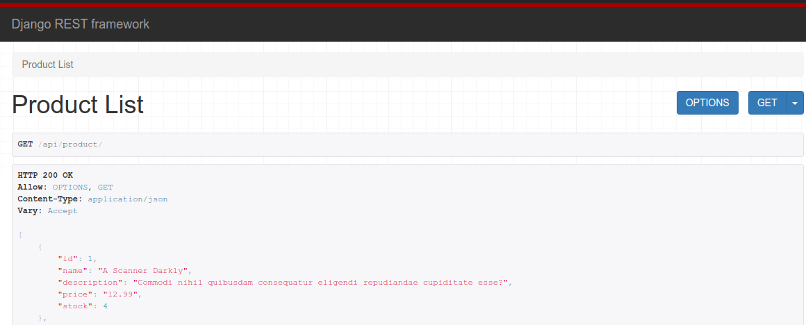
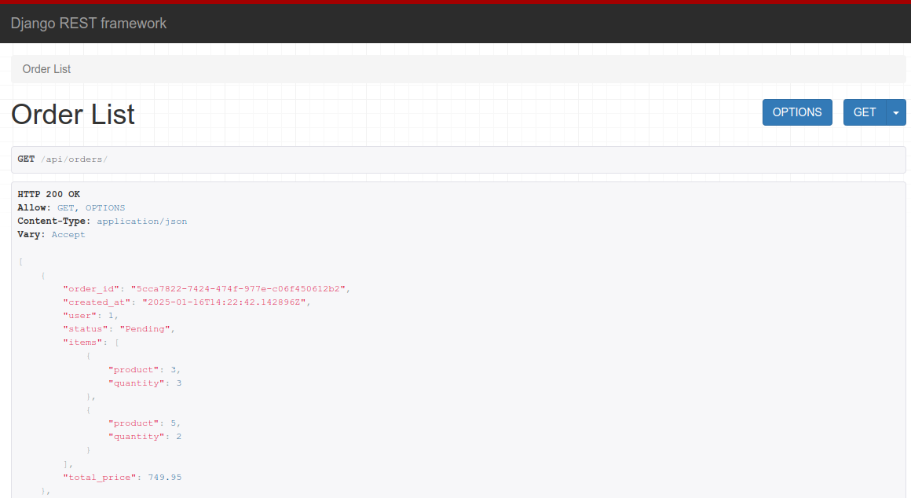

# Django-REST-framework


---

## Serializers

- Serializers allow complex data such as querysets and model instances to be converted to native Python datatypes that can then be easily rendered into JSON, XML or other content types. Serializers also provide deserialization, allowing parsed data to be converted back into complex types, after first validating the incoming data.

## How serializer Works

- Define a Serializer Class: Create a serializer class that specifies the fields you want to include and the type of data they represent.
- Serialization: Convert complex data (like model instances or querysets) to native Python data types.
- Rendering: Convert these native Python data types into JSON (or another format) to be sent to the client.
- Deserialization: Convert JSON data received from the client into native Python data types, then into complex data types (like model instances) after validation.

## ModelSerializer

The ModelSerializer class provides a shortcut that lets you automatically create a Serializer class with fields that correspond to the Model fields.

1- model.py

```` python
  class Product(models.Model):
      name = models.CharField(max_length=200)
      description = models.TextField()
      price = models.DecimalField(max_digits=10, decimal_places=2)
      stock = models.PositiveBigIntegerField()
      image = models.ImageField(upload_to='images/project',null=True,blank=True)
````

2- serializer.py

````python
class ProductSerializers(serializers.ModelSerializer):
    class Meta:
        model = Product
        fields = (
            'id',
            'name',
            'description',
            'price',
            'stock',
        )
    
    #validation
    def vaildate_price(self, value):
        if value <= 0 :
            raise serializers.ValidationError("Value can not be Zero ")
        return value
````

- The ModelSerializer class is the same as a regular Serializer class, except that:

    1. It will automatically generate a set of fields for you, based on the model.
    2. It will automatically generate validators for the serializer, such as unique_togethe validators.
    3. It includes simple default implementations of .create() and .update().

## How to set Field level Validation on serialises

- we have `price` field in our model and we need to make sure the price not less than zero
we can write a  custom field-level validation by adding .validate_<field_name> methods to our Serializer subclass. These are similar to the .clean_<field_name> methods on Django forms.

  ```` python

    def vaildate_price(self, value):
        if value <= 0 :
            raise serializers.ValidationError("Value can not be Zero ")
        return value

  ````

## Responses

- Unlike regular HttpResponse objects, you do not instantiate Response objects with rendered content. Instead you pass in unrendered data, which may consist of any Python primitives.
  
  ````python
    @api_view(['GET'])
    def product_list(request):
        product = Product.objects.all()
        serializers = ProductSerializers(product,many=True)
        return Response(serializers.data)
  ````



## Nested Serializers , SerializerMethodField , Serializer Relations

**Nested Serializers**

- To easily join parent and child objects inside a single response body, you can use a nested serializer.
  
````python

  class orderSerializer(serializers.ModelSerializer):
      items = OrderItemSerializer(many=True, read_only=True)
      total_price = serializers.SerializerMethodField(method_name="total")
  
````

- then add the OrderItemSerializer as many because we expect to get more than one field and the related_name as field name. <related_name> = <serializer_name>(many=True, read_only=True)

````python

class orderSerializer(serializers.ModelSerializer):
    items = OrderItemSerializer(many=True, read_only=True)
    class Meta:
        model = Order
        fields = (
            'order_id',
            'created_at',
            'user',
            'status',
            'items',
        )

````




**Serializer Relations**

-Relational fields are used to represent model relationships. They can be applied to ForeignKey, ManyToManyField and OneToOneField relationships, as well as to reverse relationships, and custom relationships such as GenericForeignKey.

- Note: REST Framework does not attempt to automatically optimize querysets passed to serializers in terms of select_related and prefetch_related since it would be too much magic. A serializer with a field spanning an orm relation through its source attribute could require an additional database hit to fetch related objects from the database. It is the programmer's responsibility to optimize queries to avoid additional database hits which could occur while using such a serializer.

````python
class OrderItemSerializer(serializers.ModelSerializer):
    product_name = serializers.CharField(source='product.name')
    product_price = serializers.DecimalField(source='product.price',max_digits=10, decimal_places=2)
    
    class Meta:
        model = OrderItem
        fields = (
            "product_name",
            "product_price",
            "quantity",
            "item_subtotal",
        )


class orderSerializer(serializers.ModelSerializer):
    items = OrderItemSerializer(many=True, read_only=True)
    total_price = serializers.SerializerMethodField(method_name="total")
    
    def total(self,obj):
        order_items = obj.items.all()
        return sum (order_items.item_subtotal for order_items in order_items)
    class Meta:
        model = Order
        fields = (
            'order_id',
            'created_at',
            'user',
            'status',
            'items',
            'total_price',
        )
````

**Nested relationships**

- As opposed to previously discussed references to another entity, the referred entity can instead also be embedded or nested in the representation of the object that refers to it. Such nested relationships can be expressed by using serializers as fields.
If the field is used to represent a to-many relationship, you should add the many=True flag to the serializer field.

````python
class TrackSerializer(serializers.ModelSerializer):
    class Meta:
        model = Track
        fields = ['order', 'title', 'duration']

class AlbumSerializer(serializers.ModelSerializer):
    tracks = TrackSerializer(many=True, read_only=True)

    class Meta:
        model = Album
        fields = ['album_name', 'artist', 'tracks']
````

**Responde**

````json
{
    'album_name': 'The Grey Album',
    'artist': 'Danger Mouse',
    'tracks': [
        {'order': 1, 'title': 'Public Service Announcement', 'duration': 245},
        {'order': 2, 'title': 'What More Can I Say', 'duration': 264},
        {'order': 3, 'title': 'Encore', 'duration': 159},
        ...
    ],
}

````

**Serializer fields**

- Serializer fields handle converting between primitive values and internal datatypes. They also deal with validating input values, as well as retrieving and setting the values from their parent objects.
  
````python
class OrderItemSerializer(serializers.ModelSerializer):
    product_name = serializers.CharField(source='product.name')
    product_price = serializers.DecimalField(source='product.price',max_digits=10, decimal_places=2)
    
    class Meta:
        model = OrderItem
        fields = (
            "product_name",
            "product_price",
            "quantity",
            "item_subtotal",
        )
````

**SerializerMethodField**

````python
class orderSerializer(serializers.ModelSerializer):
    total_price = serializers.SerializerMethodField(method_name="total")
    
    def total(self,obj):
        order_items = obj.items.all()
        return sum (order_items.item_subtotal for order_items in order_items)
    
    class Meta:
        model = Order
        fields = (
            'order_id',
            'created_at',
            'user',
            'status',
            'total_price',
        )
````

**Responde**

````json
    {
        "order_id": "5cca7822-7424-474f-977e-c06f450612b2",
        "created_at": "2025-01-16T14:22:42.142896Z",
        "user": 1,
        "status": "Pending",
        "items": [
            {
                "product_name": "Velvet Underground & Nico",
                "product_price": "15.99",
                "quantity": 3,
                "item_subtotal": 47.97
            },
            {
                "product_name": "Digital Camera",
                "product_price": "350.99",
                "quantity": 2,
                "item_subtotal": 701.98
            }
        ],
        "total_price": 749.95
    },
````
